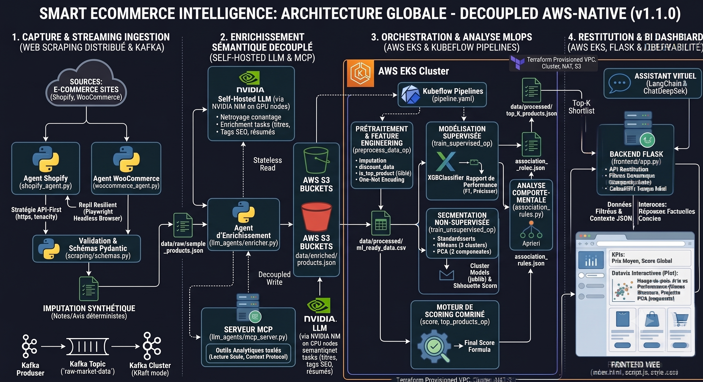
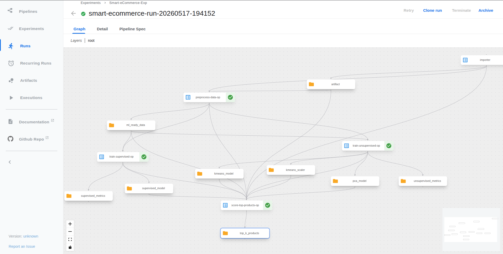
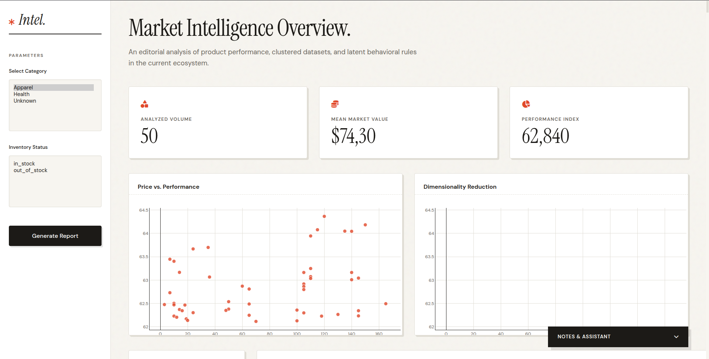

# Smart eCommerce Intelligence Platform

> **An End-to-End Autonomous eCommerce Intelligence & MLOps Platform**
> From automated multi-platform web scraping to ML-driven behavioral analysis, LLM semantic enrichment, and real-time BI visualization — all orchestrated on Kubernetes.

---

## Table of Contents

- [Overview & Business Value](#-overview--business-value)
- [System Architecture](#-system-architecture)
- [Microservices Repositories](#-microservices-repositories)
- [MLOps Pipeline (DAG)](#-mlops-pipeline-dag)
- [BI Dashboard](#-bi-dashboard)
- [Deployment & GitOps](#-deployment--gitops)
- [Authors & Contributors](#-authors--contributors)

---

## 🎯 Overview & Business Value

**Smart eCommerce Intelligence** is a production-grade microservices platform that automates the full data lifecycle for e-commerce competitive intelligence: **ingestion → streaming → enrichment → modeling → visualization**.

This organization addresses a critical business need — continuously monitoring competitor catalogs, pricing strategies, and product performance across multiple platforms (Shopify, WooCommerce) without manual intervention. It delivers:

| Capability | Description |
|---|---|
| **Automated Ingestion** | Zero-touch A2A scraping agents extract structured product data from heterogeneous e-commerce APIs with Playwright fallback for JS-rendered pages. |
| **Stream Processing** | PySpark structured streaming pipeline consumes raw events from Kafka, validates schemas, and persists market data as Parquet on S3 for downstream batch processing. |
| **Semantic Enrichment** | DeepSeek LLM, exposed through a secure MCP server, transforms raw descriptions into ML-ready features (sentiment, category mapping, attribute extraction). |
| **Predictive Scoring** | Parallel XGBoost (supervised) and K-Means/PCA (unsupervised) pipelines rank products, detect behavioral segments, and surface Top-K opportunities. |
| **Actionable BI** | Real-time dashboard with KPI tracking, cluster visualization, and a LangChain-powered conversational assistant for natural-language data queries. |

---

## 🏗️ System Architecture

The platform is organized into five decoupled layers, each independently deployable and observable, communicating via **AWS S3** artifact passing:

### 1. A2A Scraping Layer
Autonomous Agent-to-Agent crawlers target Shopify and WooCommerce storefronts using Storefront APIs, REST APIs, and Playwright for JavaScript-rendered pages. Deployed as a Kubernetes CronJob on a 6-hour schedule.

### 2. Stream Processing Layer
PySpark structured streaming pipeline consuming raw product events from Kafka, validating schemas, and writing to S3 Parquet with exactly-once semantics via checkpointing.

### 3. LLM Enrichment Layer
DeepSeek-powered semantic processing behind a secure Model Context Protocol (MCP) boundary, transforming raw product text into structured, ML-ready features.

### 4. MLOps Orchestration Layer
Kubernetes-native ML lifecycle management using Kubeflow Pipelines for declarative DAG execution, **AWS S3** for artifact storage (accessed via IRSA/boto3), and GHCR-hosted Docker images.

### 5. BI & Presentation Layer
Stateless Flask application serving an interactive analytics interface with Plotly visualizations and a LangChain-powered conversational AI assistant. Fetches data directly from AWS S3 via boto3.

---

## 📦 Microservices Repositories

The platform is decomposed into the following independent repositories:

- [**marketlens-ingestion**](https://github.com/MarketLens-AI-Platform/marketlens-ingestion) — A2A scraping agents for Shopify & WooCommerce (CronJob-driven).
- [**marketlens-stream-processor**](https://github.com/MarketLens-AI-Platform/marketlens-stream-processor) — PySpark Kafka → S3 Parquet streaming pipeline.
- [**marketlens-llm-mcp**](https://github.com/MarketLens-AI-Platform/marketlens-llm-mcp) — DeepSeek LLM enrichment layer and FastMCP server.
- [**marketlens-mlops**](https://github.com/MarketLens-AI-Platform/marketlens-mlops) — Kubeflow ML pipelines and model scoring logic.
- [**marketlens-frontend**](https://github.com/MarketLens-AI-Platform/marketlens-frontend) — Real-time BI dashboard and AI assistant UI.
- [**marketlens-gitops**](https://github.com/MarketLens-AI-Platform/marketlens-gitops) — Centralized K8s manifests, ArgoCD config, and deployment hub.
- [**marketlens-infrastructure**](https://github.com/MarketLens-AI-Platform/marketlens-infrastructure) — Terraform provisioning for VPC, EKS, S3 buckets, and IAM IRSA roles.

---

## ⚙️ MLOps Pipeline (DAG)

The core ML workflow executes as a Directed Acyclic Graph on Kubeflow Pipelines:

| Stage | Component | Description |
|---|---|---|
| **Preprocessing** | `preprocessing.py` | Data cleaning, missing-value imputation, and semantic feature engineering. |
| **Supervised Training** | `supervised.py` | XGBoost classifier predicting Top-K probability from pricing and engagement features. |
| **Unsupervised Training** | `unsupervised.py` | K-Means clustering for product segmentation + PCA for dimensionality reduction. |
| **Association Rules** | `association_rules.py` | Apriori algorithm mining frequent itemsets and purchasing rules. |
| **Scoring Engine** | `scoring.py` | Composite scoring unifying model outputs for final recommendations. |

---

## 📊 BI Dashboard

The interactive analytics interface provides operational visibility across the entire pipeline:

- **KPI Cards** — Real-time metrics overview.
- **PCA Projection** — 2D scatter plot of products in reduced feature space.
- **K-Means Clusters** — Distribution of product segments (Premium, Discount, Atypical).
- **Association Rules Explorer** — Interactive table of mined purchasing rules.
- **Top-K Rankings** — Sorted product table with composite scores.
- **AI Virtual Assistant** — Conversational interface powered by DeepSeek.

---

## 🚀 Deployment & GitOps

To deploy the entire platform on a Kubernetes cluster, visit the [**marketlens-gitops**](https://github.com/MarketLens-AI-Platform/marketlens-gitops) repository.

It contains:
- **ArgoCD Application** for automated sync and GitOps-driven deployment.
- **Kustomize Overlays** for managing microservice manifests.
- **Unified Makefile** for local Kubernetes provisioning (Minikube) and status monitoring.

Infrastructure is provisioned via [**marketlens-infrastructure**](https://github.com/MarketLens-AI-Platform/marketlens-infrastructure):
- **VPC & EKS Cluster** — Managed Kubernetes on AWS.
- **S3 Buckets** — Object storage for ingestion data and MLOps artifacts.
- **IAM IRSA** — Secure service-to-service authentication.

Artifacts are stored in **AWS S3** (bucket `marketlens-raw-ingestion-v110`) rather than MinIO, accessed via IAM Roles for Service Accounts.

---

## 👨‍💻 Authors & Contributors

This platform was architected and engineered by:

- **Yassine Kamouss** — Cloud Architecture, MLOps Engineering, Kubernetes, Kubeflow & Agentic AI Systems

---

Smart eCommerce Intelligence — FST Tanger, LSI 2, Modules: Data Mining & SID, 2025/2026
